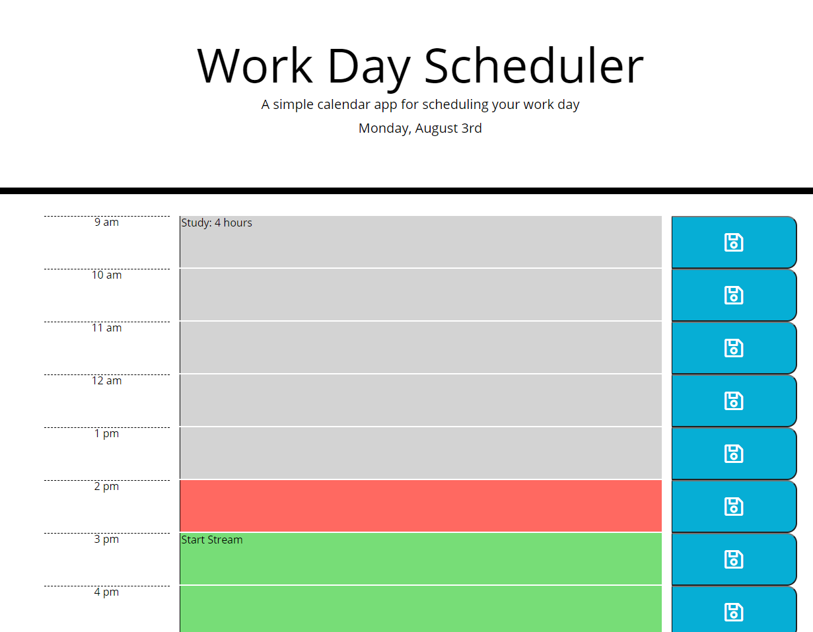

# homework-week-5

Github pages link: https://nardacyon.github.io/homework-week-5/

The goal of this app is to help people with a busy schedule, plan important events so that thy can manage their time effectively. The current day will be displayed at the top of the calendar and will always update, when scrolling down the User will be shown timeblocks that cover standard business hours (9 am - 5 pm). Each timeblock is color coded to indicate whether it is past, present, or future (grey, red, and green respectively). When clicking in a timeblock, the User can enter an event and click the save button to set the data into the timeblock. When the page is refreshed the event saved will still appear on the page.

